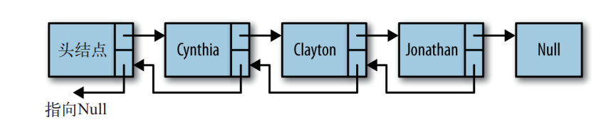
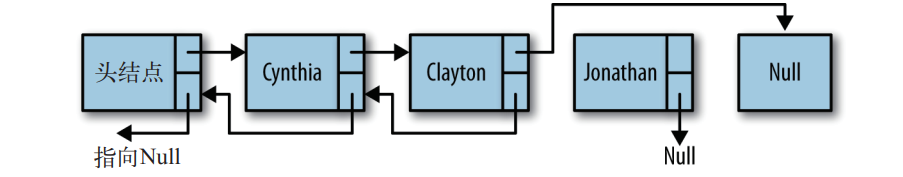

尽管从链表的头节点遍历到尾节点很简单，但反过来，从后向前遍历没那么简单。通过给Node对象增加一个属性，该属性存储指向前驱节点的链接，这样就容易多了。



```javascript
function Node(element) {
    this.element = element
    this.next = null
    this.previous = null
}

function insert(newElement, item) {
    var newNode = new Node(newElement)
    var current = this.find(item)
    newNode.next = current.next
    newNode.previous = current
    current.next = newNode
}
```

从双向链表中删除节点：



```javascript
function remove(item) {
    var currNode = this.find(item)
    if (!(currNode.next == null)) {
        currNode.previous.next == currNode.next
        currNode.next.previous = currNode.previous
        currNode.next = null
        currNode.previous = null
    }
}
```

为了完成以反序显示链表中元素这类任务，需要给双向链表增加一个工具方法，用来查找最后的节点。

```javascript
function findLast() {
    var currNode = this.head
    while (!(currNode.next == null)) {
        currNode = currNode.next
    }
    return currNode
}

// 反序显示双向链表中的元素
function dispReverse() {
    var currNode = this.head
    currNode = this.findLast()
    while (!(currNode.previous == null)) {
        console.log(currNode.element)
        currNode = currNode.previous
    }
}
```

