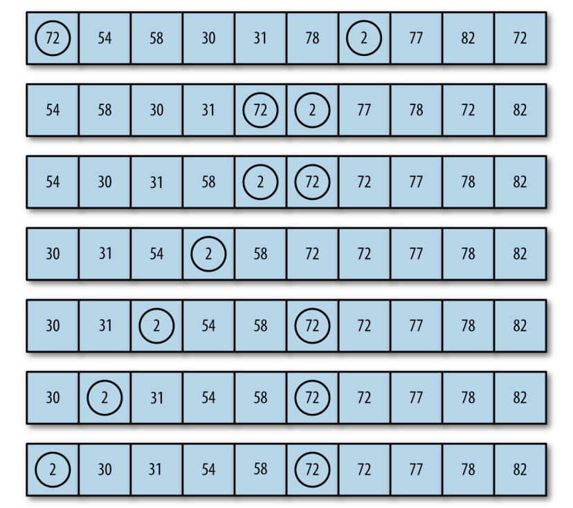

冒泡排序是最慢的排序算法之一。

冒泡排序，数据值会像气泡一样从数据的一端飘浮到另一端。假设正在将一组数字按照升序排列，较大的值会浮动到数组的右侧，而较小的值则会浮动到数组的左侧。例如：



```javascript
function bubbleSort() {
    var numElements = this.dataStore.length
    var temp
    for (var outer = numElements; outer >= 2; --outer) {
        for (var inner = 0; inner <= outer - 1; ++inner) {
            if (this.dataStore[inner] > this.dataStore[inner + 1]) {
                swap(this.dataStore, inner, inner + 1)
            }
        }
    }
}
```

百度百科版本：

```javascript
function bubbleSort(arr) {
    var i = arr.length, j;
    var tempExchangVal;
    while (i > 0) {
        for (j = 0; j < i - 1; j++) {
            if (arr[j] > arr[j + 1]) {
                tempExchangVal = arr[j];
                arr[j] = arr[j + 1];
                arr[j + 1] = tempExchangVal;
            }
        }
        i--;
    }
    return arr;
}
 
var arr = [3, 2, 4, 9, 1, 5, 7, 6, 8];
var arrSorted = bubbleSort(arr);
console.log(arrSorted);
// alert(arrSorted);
```


