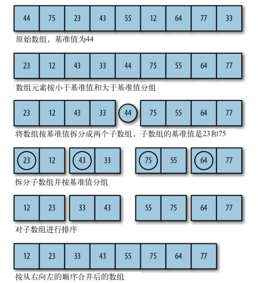

排序算法是处理大数据集最快的排序算法之一。它是一种分而治之的算法，通过递归的方式将数据依次分解为包含较小元素和较大元素的不同子序列。该算法不断重复这个步骤直到所有数据都是有序的。

这个算法首先要在列表中选择一个元素作为**基准值(pivot)**。数据排列围绕基准值进行，将列表中小于基准值的元素移动到数组的底部，将大于基准值的元素移动到数据的顶部。例如：



#### 快速排序算法：

1. 选择一个基准元素，将列表分割为两个子序列
2. 对列表重新排序，将所有小于基准值的元素放在基准值的前面，所有大于基准值的元素放在基准值的后面
3. 分别对较小元素的子序列和较大元素的子序列重复步骤1和2

```javascript
function qSort(arr) {
    if (arr.length === 0) {
        return [];
    }
    var left = []
    var right = []
    var pivot = arr[0]
    for (var i = 1; i < arr.length; i++) {
        console.log(" 基准值： " + pivot + " 当前元素： " + arr[i])
        if (arr[i] < pivot) {
            console.log(" 移动 " + arr[i] + " 到左边 ")
            left.push(arr[i])
        } else {
            console.log(" 移动 " + arr[i] + " 到右边 ")
            right.push(arr[i])
        }
    }
    return qSort(left).concat(pivot, qSort(right))
}
var a = [];
for (var i = 0; i < 10; ++i) {
	a[i] = Math.floor((Math.random()*100)+1);
}
console.log(a)
console.log(qSort(a))
```

快速排序算法非常适用于大型数据集合；在处理小数据集时性能反而会下降。