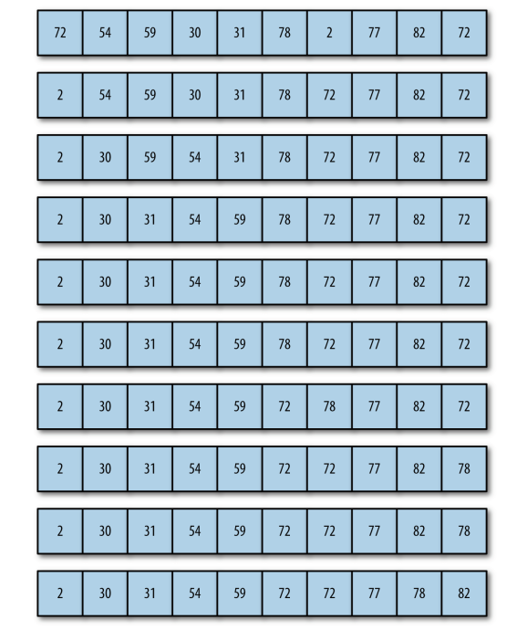

选择排序从数组的开头开始，将第一个元素和其它元素进行比较。检查完所有元素后，最小的元素会被放到数组的第一个位置，然后算法会从第二个位置继续。这个过程一直进行，当进行到数组的倒数第二个位置时，所有的数据便完成了排序。

选择排序会用到嵌套循环。外循环从数组的第一个元素移动到倒数第二个元素；内循环从第二个元素移动到最后一个元素，查找比当前外循环所指向的元素小的元素。每次内循环迭代后，数组中最小的值都会被赋值到合适的位置。

#### 算法分析：

选择排序的交换操作介于0和`(n-1)`次之间，选择排序的比较操作为`n(n-1)/2`次之间。选择排序的赋值操作介于0和`3(n-1)`次之间。

比较次数`O(n^2）`，比较次数与关键字的初始状态无关，总的比较次数`N=(n-1）+(n-2）+...+1=n*(n-1）/2`。交换次数`O(n）`，最好情况是，已经有序，交换0次；最坏情况交换`n-1`次，逆序交换`n/2`次。交换次数比[冒泡排序](https://baike.baidu.com/item/%E5%86%92%E6%B3%A1%E6%8E%92%E5%BA%8F)少多了，由于交换所需CPU时间比比较所需的CPU时间多，n值较小时，选择排序比冒泡排序快。 

例如：



```javascript
function selectionSort() {
    var min, temp;
    for (var outer = 0; outer <= this.dataStore.length - 2; ++ outer) {
        min = outer;
        for (var inner = outer + 1; inner <= this.dataStore.length - 1; ++inner) {
            if (this.dataStore[inner] < this.dataStore[min]) {
                min = inner;
            }
        }
        swap(this.dataStore, outer, min);
    }
}
```

选择排序是不稳定的排序算法（比如序列`[5,5,3]`第一次就将第一个`[5]`和`[3]`交换，导致第一个5挪到第二个5后面）。