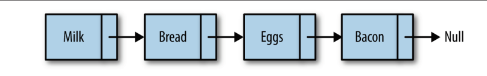

JavaScript中数组的主要问题是，它们被实现成了对象，与其他语言（比如C++和Java）的数组相比，效率很低。<br>
如果你发现数组在实际使用时很慢，就可以考虑使用链表来代替它。除了对数据的随机访问，链表几乎可以用在任何可以使用一维数组的情况中。如果需要随机访问，数组仍然是更好的选择。<br>
链表是由一组节点组成的集合。每个节点都使用一个对象的引用指向它的后继。指向另一个节点的引用叫做链。


标识出链表的起始节点有点麻烦，许多链表的实现都在链表最前面有一个特殊节点，叫做头节点。例如：


链表中插入一个节点的效率很高。向链表中插入一个节点，需要修改它前面的节点（前驱），使其指向新加入的节点，而新加入的节点则指向原来前驱指向的节点。例如向链表中插入元素cookies：


从链表中删除一个元素也很简单。将待删除元素的前驱节点指向待删除元素的后继节点，同时将待删除元素指向null，元素就删除成功了。例如从链表中删除Bacon：


我们设计的链表包含两个类。Node类用来表示节点，LinkedList类提供了插入节点、删除节点、显示列表元素的方法，以及其他一些辅助方法。

```javascript
function Node(element) {
    this.element = element
    this.next = null
}
```